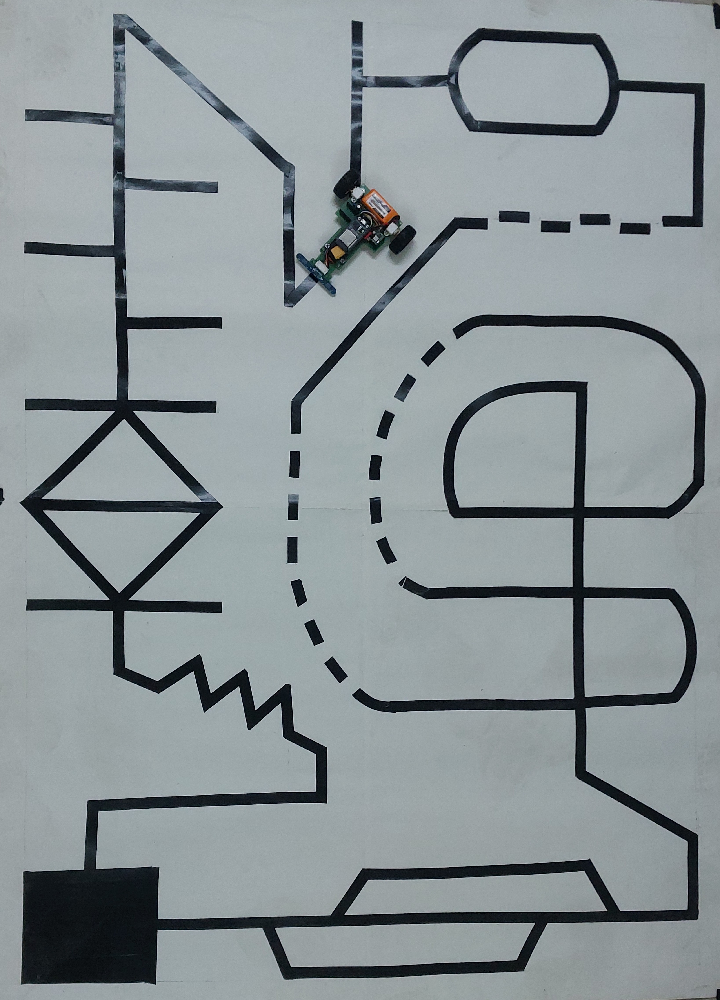
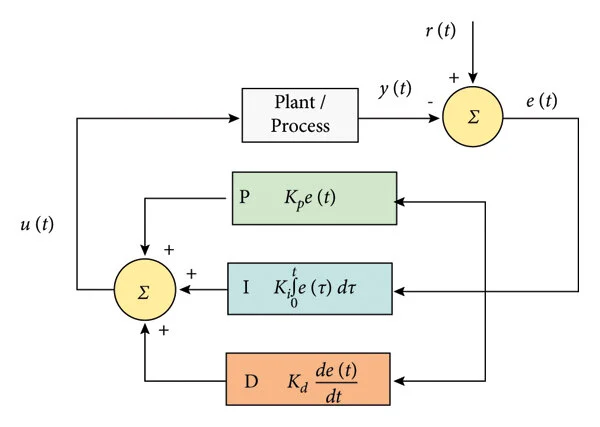
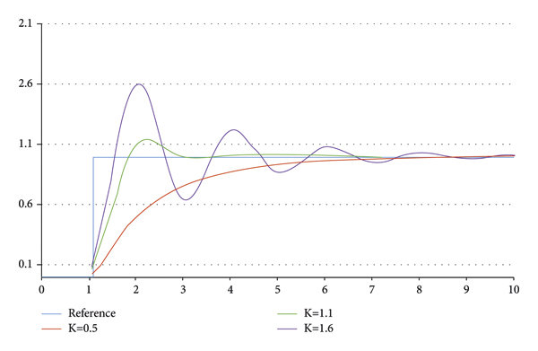
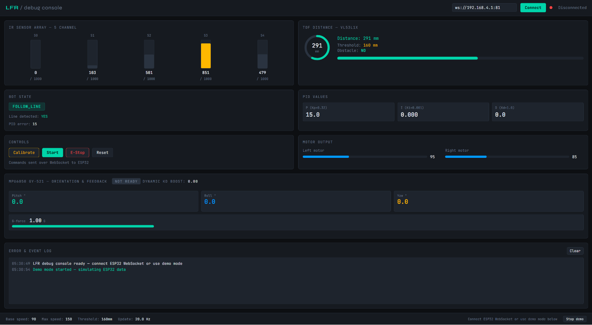

<div align="center">

# PID-Line Follower Robot

### Line Follower Robot with PID Control, IMU Feedback, Obstacle Avoidance & Real-Time Web Dashboard

<br/>

> A fully custom-built autonomous Line Follower Robot using a **5-channel IR sensor array** and a **PID control loop**, with real-time telemetry streamed over Wi-Fi to a browser-based debug dashboard. Prototyped in **Proteus 8 with Arduino Nano**, then deployed on a custom PCB with an **ESP32-S3**. Now features **MPU6050 IMU integration** for orientation feedback, dynamic PID improvement, and tilt-stop safety, plus a **2S LiPo battery monitor** with lockout protection.

<br/>



</div>

---

## Overview

This project implements an autonomous **Line Follower Robot (LFR)** capable of:

- Tracking black lines on a white surface using a **5-channel IR sensor array**
- Applying a **PID (Proportional-Integral-Derivative)** controller for smooth, real-time motor corrections
- Detecting and avoiding obstacles with a **VL53L1X Time-of-Flight** sensor
- Measuring orientation and motion with an **MPU6050 6-axis IMU** for tilt-stop safety and dynamic Kd tuning
- Monitoring **2S LiPo battery voltage** in real time with rolling average, load compensation, and drive lockout below 6.8 V
- Serving a **live WebSocket debug dashboard** over Wi-Fi for remote monitoring, control, and IMU telemetry

The development followed a two-stage pipeline: circuit design and validation in **Proteus 8 Professional** (targeting an Arduino Nano), followed by firmware deployment on a custom PCB driven by an **ESP32-S3**.

---

## Features

| Feature | Details |
|---|---|
| **PID Line Following** | Weighted error across 5 IR sensors; tunable Kp, Ki, Kd |
| **Dynamic Kd Boost** | MPU6050 gyro Y rate detects oscillation in real time and temporarily increases Kd to dampen it, decaying when settled |
| **Obstacle Avoidance** | VL53L1X ToF at 160 mm threshold; full 12-state FSM avoidance and retrace |
| **MPU6050 IMU** | Complementary filter pitch/roll/yaw at ~100 Hz; tilt-stop at >50°; impact detection at >3G; pivot angle tracking |
| **Battery Monitor** | 100 kΩ/47 kΩ voltage divider on GPIO 8; 64-sample rolling average; load sag compensation; lockout below 6.8 V |
| **Wi-Fi Dashboard** | WebSocket AP on ESP32; live sensor, motor, PID, IMU, and battery telemetry at ~20 Hz |
| **E-Stop & Calibration** | Remote commands over WebSocket: `CALIBRATE`, `START`, `STOP`, `RESET` |
| **Hardware Buttons** | Physical CAL (GPIO 41) and START (GPIO 42) buttons with battery lockout |
| **Onboard LED + Buzzer** | RGB LED on GPIO 48 (status); passive buzzer on GPIO 40 (beep alerts) |
| **Custom PCB** | ESP32-S3 + TB6612FNG motor driver on a single green-substrate board |

---

## Hardware

### Components List

#### Microcontroller

| MCU | Role |
|---|---|
| ESP32-S3 | Wi-Fi AP, WebSocket server, full PID + IMU firmware, dual I2C buses |

#### Sensors & Actuators

| Component | Qty | Description |
|---|---|---|
| IR Tracker Sensor Module | 5 | Analog reflectance sensors; 5 V supply, logic divided to 3.3 V via 22 kΩ/10 kΩ dividers |
| VL53L1X ToF Sensor | 1 | I2C Time-of-Flight distance; used at 160 mm obstacle threshold (Wire — GPIO 17/18) |
| MPU6050 GY-521 | 1 | 6-axis IMU (accel + gyro); complementary-filter orientation (Wire1 — GPIO 9/10) |
| N20 DC Gear Motor | 2 | 600 rpm; drive wheels controlled via PWM through TB6612FNG |

#### Power & Driver

| Component | Value / Part | Description |
|---|---|---|
| LiPo Battery | 7.4 V 2S, 350 mAh | Main power source |
| Buck Converter | Mini 360 | Steps 7.4 V down to 5 V logic rail |
| Schottky Diode | 1N5817 | Reverse polarity protection on battery positive |
| Fast Diode | 1 × fast-recovery | Flyback protection |
| Motor Driver | TB6612FNG | Dual H-bridge; PWMA/B, AIN1-2, BIN1-2 control lines |
| Voltage Divider | 100 kΩ + 47 kΩ | Battery voltage sense to GPIO 8 ADC |
| Filter Cap | 0.1 µF | Across lower resistor of voltage divider (RC low-pass, ~16 Hz cutoff) |
| Status LED | Onboard WS2812B (GPIO 48) | RGB NeoPixel — white when headlights on, off otherwise |
| Passive Buzzer | GPIO 40 | Beep alerts: calibration done, start, error, battery low |

---

### Circuit Schematic

The circuit was designed in **Proteus 8 Professional**. Key connections:
<br>
<br/>


---

### ESP32-S3 Pin Map

> This is the connection used in the actual deployed build. The Arduino Nano simulation pinout has been removed as it is not relevant to the current firmware.

#### Motor Driver — TB6612FNG

| ESP32-S3 GPIO | TB6612FNG Pin | Function |
|---|---|---|
| GPIO 21 | AIN1 | Left motor direction A |
| GPIO 39 | AIN2 | Left motor direction B |
| GPIO 47 | PWMA | Left motor PWM speed |
| GPIO 37 | BIN1 | Right motor direction A |
| GPIO 36 | BIN2 | Right motor direction B |
| GPIO 35 | PWMB | Right motor PWM speed |
| GPIO 2  | STBY | Driver standby (pulled HIGH to enable) |

#### IR Sensor Array — 5 Channel

| ESP32-S3 GPIO | Sensor | Notes |
|---|---|---|
| GPIO 4  | S0 (far left)  | Analog read; 22 kΩ/10 kΩ logic divider from 5 V |
| GPIO 5  | S1 (left)      | Analog read |
| GPIO 6  | S2 (centre)    | Analog read |
| GPIO 7  | S3 (right)     | Analog read |
| GPIO 15 | S4 (far right) | Analog read |

#### ToF Sensor — VL53L1X (I2C Bus 0 — Wire)

| ESP32-S3 GPIO | Function |
|---|---|
| GPIO 17 | SDA |
| GPIO 18 | SCL |
| GPIO 16 | XSHUT (reset) |

#### IMU — MPU6050 GY-521 (I2C Bus 1 — Wire1)

> Uses a separate I2C peripheral so it does not conflict with the VL53L1X.

| ESP32-S3 GPIO | Function |
|---|---|
| GPIO 9  | SDA |
| GPIO 10 | SCL |

#### Controls & Peripherals

| ESP32-S3 GPIO | Component | Function |
|---|---|---|
| GPIO 41 | Calibrate button | Active LOW, INPUT_PULLUP |
| GPIO 42 | Start button      | Active LOW, INPUT_PULLUP |
| GPIO 48 | WS2812B NeoPixel  | Onboard RGB LED — white on / off |
| GPIO 40 | Passive buzzer    | ledcWriteTone — beep alerts |
| GPIO 8  | Voltage divider   | 100 kΩ/47 kΩ → ADC_11db attenuation |

#### Complete Wiring Summary

```
ESP32-S3
├── GPIO 4,5,6,7,15  → IR sensor array S0–S4 (analog, via 22k/10k dividers)
├── GPIO 17,18       → VL53L1X SDA/SCL (Wire, I2C bus 0)
├── GPIO 16          → VL53L1X XSHUT
├── GPIO 9,10        → MPU6050 SDA/SCL (Wire1, I2C bus 1)
├── GPIO 21,39       → AIN1,AIN2  ─┐
├── GPIO 47          → PWMA        │  TB6612FNG
├── GPIO 37,36       → BIN1,BIN2   │  motor driver
├── GPIO 35          → PWMB        │
├── GPIO 2           → STBY ───────┘
├── GPIO 41          → CAL button (INPUT_PULLUP)
├── GPIO 42          → START button (INPUT_PULLUP)
├── GPIO 48          → WS2812B NeoPixel RGB
├── GPIO 40          → Passive buzzer
└── GPIO 8           → Battery voltage divider (100kΩ/47kΩ → GND)

Power Rail
Battery 7.4V → 1N5817 Schottky → Mini 360 Buck → 5V logic rail
                              └→ TB6612FNG VM (motor power)
Battery+ → 1N5817 → 100kΩ → GPIO 8
                         └→ 47kΩ + 0.1µF → GND
```

---

## PID Control Algorithm

The robot uses a **weighted position error** across the 5-sensor array to calculate how far off-centre the line is, then feeds that error into a classical PID loop.



### Error Calculation

```
Sensor weights:  S0=−20  S1=−10  S2=0  S3=+10  S4=+20

error = (−20×S0 − 10×S1 + 10×S3 + 20×S4) / 10

Positive error → line is to the right → increase left motor, decrease right
Negative error → line is to the left  → decrease left motor, increase right
```

### PID Output

```
effectiveKd = Kd + mpuKdBoost        ← dynamically adjusted by IMU

u(t) = Kp·e(t) + Ki·∫e dt + effectiveKd·(de/dt)

Left  motor speed = BASE_SPEED + u(t)    [clamped to ±MAX_SPEED]
Right motor speed = BASE_SPEED − u(t)
```

### Tuned Parameters

| Parameter | Value | Effect |
|---|---|---|
| `Kp` | 0.32 | Proportional gain — primary steering correction |
| `Ki` | 0.001 | Integral gain — eliminates long-term drift |
| `Kd` | 1.0 | Base derivative gain — damps oscillation |
| `mpuKdBoost` | 0.0–1.5 (dynamic) | Extra Kd added when gyro Y detects physical oscillation |
| `BASE_SPEED` | 90 (PWM) | Forward cruise speed |
| `MAX_SPEED` | 150 (PWM) | Maximum corrected motor speed |
| `PIVOT_SPEED` | 130 (PWM) | Sharp turn and avoidance pivot speed |
| `AVOID_SPEED` | 80 (PWM) | Forward speed during obstacle bypass |
| `RECOVER_SPEED` | 90 (PWM) | Speed when rejoining line after avoidance |



---

## IMU Integration — MPU6050

The MPU6050 GY-521 runs on **Wire1 (GPIO 9/10)** at 400 kHz, completely independent of the ToF sensor on Wire. It is read using raw I2C register access — no additional library required beyond `Wire.h`.

### Configuration

| Register | Setting | Value |
|---|---|---|
| PWR_MGMT_1 (0x6B) | Wake up, use internal oscillator | 0x00 |
| GYRO_CONFIG (0x1B) | ±500 °/s full scale | 0x08 — 65.5 LSB/°/s |
| ACCEL_CONFIG (0x1C) | ±4 g full scale | 0x08 — 8192 LSB/g |
| CONFIG (0x1A) | DLPF bandwidth ~20 Hz | 0x04 — kills motor vibration noise |

### Startup Calibration

On power-on, `initMPU()` collects 200 samples with the bot stationary and computes gyro and accel offsets for all 6 axes. These are subtracted from every subsequent reading.

### Complementary Filter

```
dt = time since last sample (seconds)

aPitch = atan2(−ax, √(ay²+az²))   ← accel-derived pitch (no drift, noisy)
aRoll  = atan2(ay, az)              ← accel-derived roll

pitch = 0.96 × (pitch + gx×dt) + 0.04 × aPitch
roll  = 0.96 × (roll  + gy×dt) + 0.04 × aRoll
yaw  += gz × dt                     ← gyro integration only (drifts)
```

### Smart Safety Features

| Feature | Threshold | Behaviour |
|---|---|---|
| **Tilt-stop** | `max(|pitch|, |roll|) > 50°` | Motors cut immediately → `ERROR_STOP`; logged to dashboard |
| **Impact detection** | G-force > 3G | `impactDetect` flag set for 500 ms; shown on dashboard |
| **Dynamic Kd boost** | Gyro Y > 80 °/s in `FOLLOW_LINE` | `mpuKdBoost` added to Kd (max +1.5), decays at 8%/loop when oscillation settles |
| **Pivot tracking** | Active during all pivot states | `pivotYawAccum` integrates gyro Z — shows actual degrees turned vs. time-based target |

### Telemetry Fields Added

| JSON Key | Value | Description |
|---|---|---|
| `mpu` | bool | IMU found and active |
| `pit` | int × 10 | Pitch in degrees × 10 |
| `rol` | int × 10 | Roll in degrees × 10 |
| `yaw` | int × 10 | Yaw in degrees × 10 |
| `gf` | int × 100 | G-force × 100 |
| `tilt` | bool | Tilt-stop active |
| `imp` | bool | Impact detected |
| `kdb` | int × 100 | Dynamic Kd boost × 100 |

---

## Battery Monitoring

A resistor voltage divider on **GPIO 8** monitors the 2S LiPo pack voltage continuously throughout runtime.

### Circuit

```
Battery+ → 1N5817 Schottky → 100 kΩ → GPIO 8 (ADC_11db)
                                    └→ 47 kΩ + 0.1 µF → GND

Divider ratio = 47 / (100 + 47) = 0.31973
0.1 µF cap → RC low-pass, cutoff ~16 Hz — kills motor PWM switching noise
```

### Algorithm

- **Sampling:** 4 ADC reads per call; middle two averaged (rejects min/max spike outliers)
- **Rolling average:** 64-sample buffer (~3.2 s window) for stable display
- **Load compensation:** +150 mV added to reading when motors are running (ESR sag correction)
- **Thresholds:**

| Threshold | Voltage | Action |
|---|---|---|
| Full | 8.40 V | 100% display |
| Low warning | 6.80 V | Beep alert every 10 s; lockout activates |
| Empty | 6.40 V | 0% display |

- **Lockout:** When raw voltage ≤ 6.80 V, CAL button, START button, and dashboard START command are all blocked. If bot is running when lockout triggers, motors stop immediately and state → `ERROR_STOP`.

---

## Final Build (ESP32-S3)

The validated design was ported to a custom-fabricated PCB with an **ESP32-S3** as the main controller, adding Wi-Fi capability for the live dashboard.


**Features over original simulation design:**
- ATmega328P replaced by **ESP32-S3** (dual-core 240 MHz, built-in Wi-Fi)
- WebSocket server hosted directly on the robot (AP mode, `192.168.4.1:81`)
- VL53L1X ToF sensor added for obstacle detection on Wire (GPIO 17/18)
- **MPU6050 GY-521** added for IMU feedback on Wire1 (GPIO 9/10)
- State machine expanded to 12 states (line follow + full avoidance + retrace)
- **2S LiPo battery monitor** with voltage divider, rolling average, load compensation, drive lockout
- Physical calibrate/start buttons with battery lockout awareness
- WS2812B NeoPixel (GPIO 48) + passive buzzer (GPIO 40) for on-robot feedback
- Custom green PCB with direct motor connector header and sensor ribbon cable

---

## Web Debug Dashboard

A single-file HTML dashboard (`lfr_dashboard.html`) connects to the ESP32's WebSocket server and provides real-time telemetry.



### Dashboard Panels

| Panel | What it shows |
|---|---|
| **IR Sensor Array** | Live bar graph for all 5 channels (0–1000), colour-coded by activity |
| **ToF Distance** | Circular gauge + linear bar for VL53L1X reading; red alert below 160 mm |
| **Bot State** | FSM state badge — green = FOLLOW_LINE, blue = AVOID_*, orange = RETRACE_*, red = ERROR_STOP |
| **PID Values** | Live P, I, D component values with gain labels |
| **Motor Output** | Dual progress bars for left/right PWM — blue = forward, red = reverse |
| **MPU6050 IMU** | Pitch/roll/yaw with bilateral bars (colour-coded by severity); G-force bar; tilt-stop and impact alert badges; live dynamic Kd boost value |
| **Controls** | Calibrate / Start / E-Stop / Reset — JSON commands over WebSocket; Start/Calibrate disabled when battery low |
| **Event Log** | Timestamped log of state changes, obstacle events, battery alerts, IMU events |
| **Demo mode** | Offline simulation of ESP32 data for dashboard preview without hardware |

### WebSocket JSON Protocol

**ESP32 → Browser (telemetry, ~20 Hz):**
```json
{
  "s":   [0, 55, 485, 874, 454],
  "t":   371,
  "st":  2,
  "ol":  true,
  "err": 15,
  "p":   15,
  "i":   0,
  "dd":  0,
  "m1":  95,
  "m2":  85,
  "vr":  742,
  "va":  745,
  "bp":  68,
  "bl":  false,
  "blk": false,
  "mpu": true,
  "pit": 23,
  "rol": -11,
  "yaw": 145,
  "gf":  103,
  "tilt":false,
  "imp": false,
  "kdb": 0
}
```

**Browser → ESP32 (commands):**
```json
{ "cmd": "CALIBRATE" }
{ "cmd": "START" }
{ "cmd": "STOP" }
{ "cmd": "RESET" }
```

### Connecting to the Dashboard

1. Power on the robot
2. Connect your device to Wi-Fi SSID: `LFR_Debug` / password: `12345678`
3. Open `lfr_dashboard.html` in a browser
4. Set WebSocket URL to `ws://192.168.4.1:81` and click **Connect**
5. Use **Calibrate** to run the 4-second sensor sweep, then **Start** to begin line following
6. Use **Start demo** to preview the dashboard offline with simulated data

---

## State Machine

The firmware implements a 12-state FSM. The MPU tilt-stop check runs at the top of `FOLLOW_LINE` before any other logic.

```
WAIT_CALIBRATE
      │  CAL button or CALIBRATE command
      ▼
WAIT_START
      │  START button or START command (blocked if battery < 6.8V)
      ▼
FOLLOW_LINE ◀──────────────────────────────────┐
      │  MPU tilt > 50° → ERROR_STOP            │
      │  ToF < 160 mm → avoidance               │
      │  PID + dynamic Kd (MPU gyro Y feedback) │
      ▼                                         │
AVOID_LEFT_TURN                                 │
      ▼                                         │
AVOID_LEFT_FORWARD                              │
      ▼                                         │
AVOID_RIGHT_TURN                                │
      ▼                                         │
AVOID_REJOIN_LINE ──────────────────────────────┘
      │  line not found within 1200 ms
      ▼
RETRACE_REJOIN_BACK
      ▼
RETRACE_LEFT_TURN
      ▼
RETRACE_SIDE_BACK
      ▼
RETRACE_RIGHT_TURN → ERROR_STOP (if retrace also fails)

ERROR_STOP  — motors stopped; RESET command required to resume
```

---

## Getting Started

### Prerequisites

- [Arduino IDE](https://www.arduino.cc/en/software) ≥ 2.0 or [PlatformIO](https://platformio.org/)
- ESP32-S3 board package (`https://raw.githubusercontent.com/espressif/arduino-esp32/gh-pages/package_esp32_index.json`)

### Libraries Required

Install via Arduino Library Manager:

```
Adafruit VL53L1X       — ToF sensor driver
WebSockets             — WebSocket server (by Markus Sattler)
ArduinoJson            — JSON serialisation (v6.x)
Wire                   — I2C bus 0 (built-in)
WiFi                   — ESP32 Wi-Fi (built-in)
```

> `Wire.h` provides both `Wire` (VL53L1X, GPIO 17/18) and `Wire1` (MPU6050, GPIO 9/10) — no additional library needed for the IMU.

Install via `platformio.ini`:
```ini
lib_deps =
    adafruit/Adafruit VL53L1X
    links2004/WebSockets
    bblanchon/ArduinoJson@^6
```

### Flashing the ESP32-S3

```bash
git clone https://github.com/yash-saini-nx/LFR-PID-ESP32.git
cd LFR-PID-ESP32

# Open pid_main.ino in Arduino IDE
# Board: ESP32S3 Dev Module
# Upload speed: 921600
# Select port, then Upload
```

### Using the Dashboard

```bash
# Open directly in browser — no build step required
open lfr_dashboard.html

# Or serve locally
python3 -m http.server 8080
# → visit http://localhost:8080/lfr_dashboard.html
```

---

## File Structure

```
LFR-PID-ESP32/
│
├── pid_main.ino              # ESP32-S3 firmware — PID + IMU + battery + WebSocket
├── lfr_dashboard.html        # Web dashboard — single file, no build required
│
├── schematics_nano.PDF       # Proteus schematic export (Arduino Nano — simulation reference)
├── LFR_PID_CIRCUIT_DONE_*.workspace  # Proteus 8 project file
│
├── media/
│   ├── track_2.0.jpeg        # Test track photograph
│   └── strct.jpeg            # Robot build photograph
│
├── sch/
│   └── circuit_nano.png      # Schematic screenshot (simulation reference)
│
├── ctrl/
│   ├── pid_block.webp        # PID block diagram
│   └── response_plot.png     # PID step-response comparison
│
├── gui/
│   └── live_data.png         # Dashboard screenshot
│
└── README.md
```

---

## Results & Performance

| Metric | Value |
|---|---|
| Dashboard update rate | ~20 Hz |
| IMU update rate | ~100 Hz (complementary filter) |
| ToF obstacle threshold | 160 mm |
| Base forward speed | 90 PWM |
| Maximum corrected speed | 150 PWM |
| PID gains (Kp / Ki / Kd) | 0.32 / 0.001 / 1.0 |
| Dynamic Kd boost range | 0.0 – 1.5 (gyro-driven) |
| Tilt-stop threshold | 50° pitch or roll |
| Battery monitor range | 6.4 V (0%) – 8.4 V (100%) |
| Battery lockout threshold | 6.8 V |
| Track complexity | Straight, curves, zigzag, diamond, intersections |

---

## Future Work

- [x] MPU-6050 IMU integration for orientation feedback and dynamic Kd tuning
- [x] 2S LiPo battery monitoring with rolling average and drive lockout
- [x] Hardware calibrate/start buttons with battery awareness
- [x] Onboard buzzer and RGB LED status feedback
- [ ] Encoder feedback for closed-loop speed control
- [ ] OTA (Over-the-Air) firmware updates via Wi-Fi
- [ ] In-dashboard live PID gain tuning (send Kp/Ki/Kd over WebSocket)
- [ ] OLED display on-robot for standalone status
- [ ] Data logging to SD card for post-run PID analysis
- [ ] Adaptive speed scaling based on curve sharpness (from gyro Z rate)

---

## License

This project is open-source under the [MIT License](LICENSE).
